# Frequency Division Multiplexing (AM SSB Modulation)


**attachment**: [project files](https://drive.google.com/drive/u/0/folders/1Gz_GgGwg2fNDSGpa_yOlGHpIvpnGTn1r)

# 1. Record  Audios

## Selected Values for good quality audio

- $F_{s} = 48kHz$
- bit sample rate = 16 bit
- record duration = 10 sec

```matlab
FsPure = 48*1000; %sampling with 48 kHz
bitSampleRate = 16;
recorderObject = audiorecorder(FsPure, bitSampleRate, 1, 1);
recordDuration = 10;
audios = zeros(3, FsPure*recordDuration);
audios_fft = zeros(3, FsPure*recordDuration);
time = linspace(0, recordDuration, FsPure*recordDuration);
freq = linspace(-FsPure/2, FsPure/2, FsPure*recordDuration);
```

## Recording if input files not exist

```matlab
% == 1.2 == record if not exist or read it
if exist("input2.wav") == 2
    % read if files exist
    for i = 1:3
        filename = ['input', num2str(i), '.wav'];
        [audios(i,:), Fs] = audioread(filename);
    end
else 
    % start record
    for i = 1:3
        disp(["Start Record ", num2str(i)]);
        recordblocking(recorderObject, recordDuration);
        audios(i, :) = getaudiodata(recorderObject)';
        disp(["End Record ", num2str(i)]);
    end
    % listen to the record
    load chirp.mat
    for i = 1:3
        sound(audios(i,:), recorderObject.SampleRate)
        pause(recordDuration)
    end
    % save records
    for i = 1:3
        filename = ['input', num2str(i), '.wav'];
        audiowrite(filename,audios(i,:), FsPure);
    end
end
```

## for further processing

```matlab
for i = 1:3
    audios_fft(i,:) = fftshift(fft(audios(i,:)));
end
```

# 2.  LPF using suitable value

## selected bandwidth after multiple tuning

$BW = 3000$

$F_\text{cuttoff} = 2*BW = 6000$

$\omega_\text{cutoff} = 2 . \pi . F_\text{cutoff}$

```matlab
bandwidth = 3000;
f_cutoff = 2*bandwidth;
w_cutoff = 2*pi*f_cutoff;
audios_filtered = zeros(3, FsPure*recordDuration);
audios_filtered_fft = zeros(3, FsPure*recordDuration);
for i = 1:3
    audios_filtered(i,:) = lowpass(audios(i,:), bandwidth, FsPure);
    audios_filtered_fft(i,:) = fft(audios_filtered(i,:));
    audios_filtered_fft(i,:) = fftshift(audios_filtered_fft(i,:));
    %sound( audios_filtered(i,:), recorderObject.SampleRate);
    %pause(recordDuration);
   
end
```

## **Plotting**

### **Results**

- I used hand-made utility function from lab to plot this

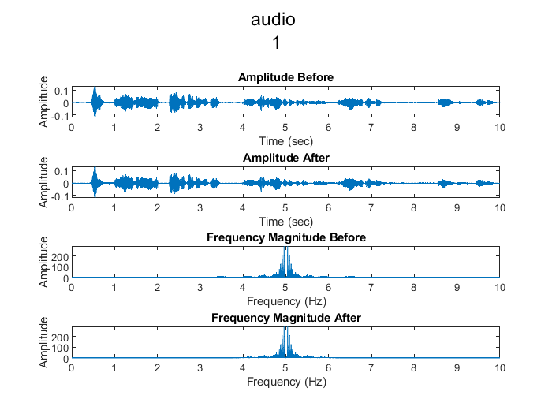

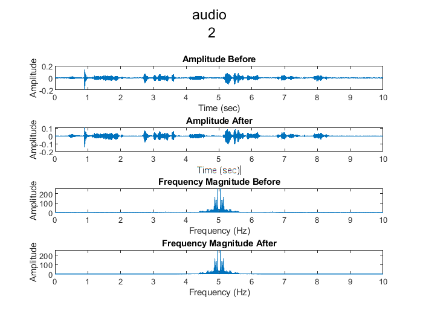

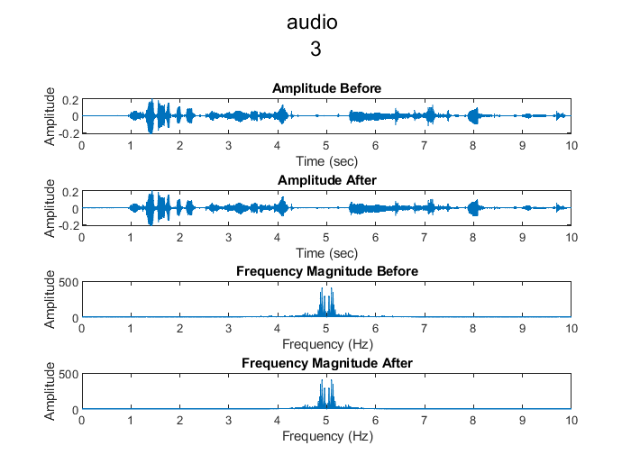

### Code

```matlab
% plot signals before and after
for i = 1:3
    figure;
    
    subplot(4,1, 1);
    
    plot(time, audios(i,:));
    title("Amplitude Before");
    xlabel('Time (sec)');
    ylabel('Amplitude');

    subplot(4,1, 2);
    
    plot(time, audios_filtered(i,:));
    title("Amplitude After");
    xlabel('Time (sec)');
    ylabel('Amplitude');
    
    subplot(4,1, 3);
      
    plot(time, abs(audios_fft(i,:)));
    title("Frequency Magnitude Before");
    xlabel('Frequency (Hz)');
    ylabel('Amplitude');

    subplot(4,1, 4);
    
    plot(time, abs(audios_filtered_fft(i,:)));
    title("Frequency Magnitude After");    
    xlabel('Frequency (Hz)');
    ylabel('Amplitude');

    sgtitle(["audio ", num2str(i)])
end
```

# 3-4.  FDM system using SSB

## initialize variables to store results

```matlab
modulated_audios_fft = zeros(3,FsPure*recordDuration);
final_signal = zeros(1,FsPure*recordDuration);
```

## Notes on Fc

- so for each signal I should choose different carrier frequency
- and for each signal the chosen carrier frequency should
    - $\text{bandwidth} \lt F_c \lt \frac{F_s}{2}$
    - $3000 < F_c < \frac{48K}{2}$
    - $2 . \text{bandwidth} <  Fc < \text{24K}$
    - $Fc = (2+1.5*i)*\text{bandwidth }$ $\text{where } i \text{ from }1→ 3$     is suitable

## Main Code

```matlab
for i = 1:3
    % initlaize
    x = audios_filtered(i,:);
    X = audios_filtered_fft(i, :);
    % initalize carrier 
    Fc = (2+1.5*i)*bandwidth ;
    Wc = 2*pi*Fc;
    c = cos(Wc .* time);
    % performing DSB modulation
    modulated_x = c .* x;
    modulated_X= fftshift(fft(modulated_x));
    % plot difference before and after modulation
    figure;
    subplot(3,1, 1);
    plot(freq, abs(X));
    title("Message (Hz)");
    subplot(3,1, 2);
    plot(freq, abs(modulated_X));
    title("Modulated Signal (Hz)");
    % perform bandwidth to take single side band
    subplot(3,1, 3);
   
    bandpass_filter3 = designfilt('bandpassfir', 'FilterOrder', 500,'CutoffFrequency1', 0.1,'CutoffFrequency2', Fc, 'SampleRate', FsPure);
    ssb_modulated_x = filter(bandpass_filter3, modulated_x);
    ssb_modulated_X = fftshift(fft(ssb_modulated_x));
    
    plot(freq, abs(ssb_modulated_X));
    title("LSB Modulated (Hz)")
    sgtitle(["SSB Modulation", num2str(i)])
    
    % added to final signal
    modulated_audios_fft(i,:) = ssb_modulated_X; % store it to print it in colorful mode

    final_signal = final_signal + ssb_modulated_x;
end
```

## Results for each signal

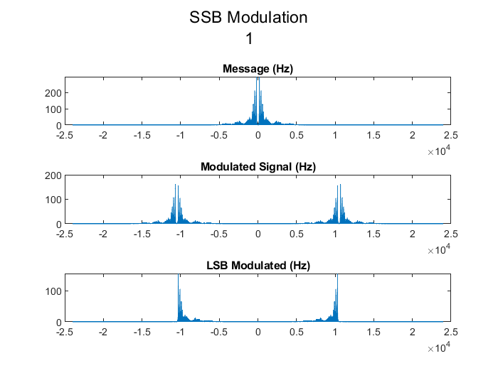

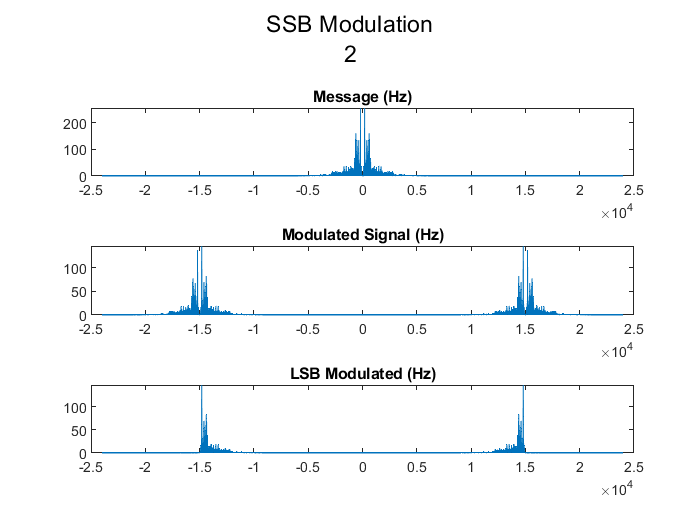

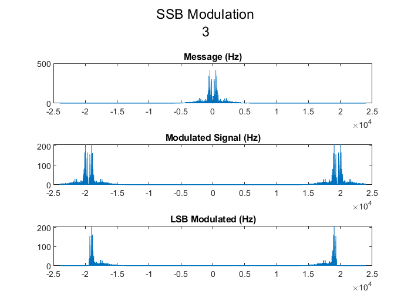

# Final Results Awesome Look

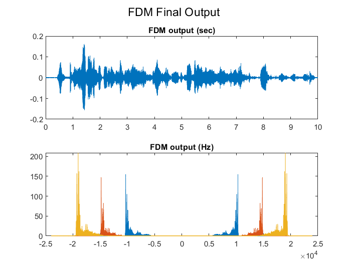

# 5. SSB Demodulation

## initialize variables to store results

```matlab
demodulated_audios = zeros(3, FsPure*recordDuration);
demodulated_audios_fft = zeros(3, FsPure*recordDuration);
```

## Main Code

```matlab
for i = 1:3
    % select channel
    Fc = (2+1.5*i)*bandwidth ;
    bandpass_filter = designfilt('bandpassfir', 'FilterOrder', 500,'CutoffFrequency1', Fc - bandwidth ,'CutoffFrequency2', Fc, 'SampleRate', FsPure);
    x_selected = filter(bandpass_filter, final_signal);
   
    c_selected = cos(Wc .* time);
    % restore result
    x_final = 4 .* c_selected .* x_selected;
    x_final = lowpass(x_final, bandwidth ,FsPure);
    % LPF 
    demodulated_audios(i,:) = x_final;
    demodulated_audios_fft(i,:) = fftshift(fft(x_final));
end
```

# Plot Final

### Code

```matlab
figure;
subplot(2, 1, 1);
plot(time, audios_filtered);
title("Message (sec)");

subplot(2, 1, 2);
plot(time, demodulated_audios);
title("Demodulated (sec)");

sgtitle("Look ON difference");
```

### Result

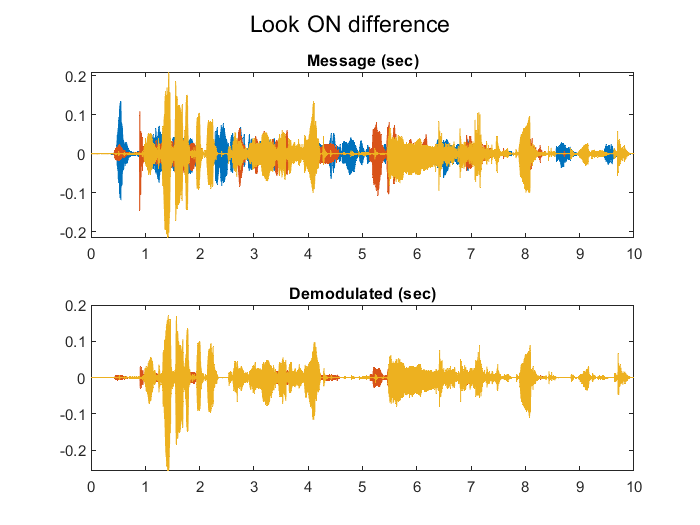

## Plot each Signal

### Code

```matlab
for i = 1:3
    figure;
    subplot(2, 1, 2);
    plot(freq, abs(demodulated_audios_fft(i,:)));
    title("Demodulated (Hz)");

    subplot(2, 1, 1);
    plot(time, demodulated_audios(i,:));
    title("Demodulated (sec)");
    sgtitle(["Output Wave", num2str(i)]);
    filename = ['output', num2str(i), '.wav'];
    audiowrite(filename, demodulated_audios(i,:), FsPure);
end
```

### Result

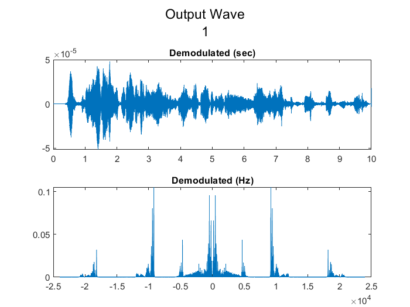

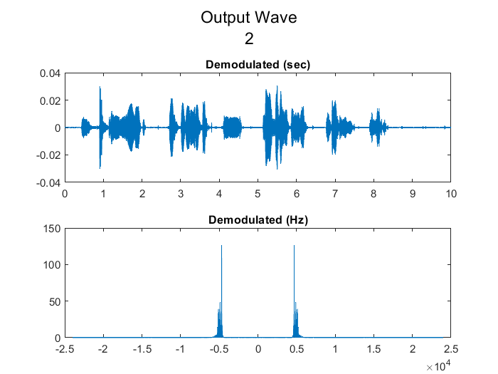

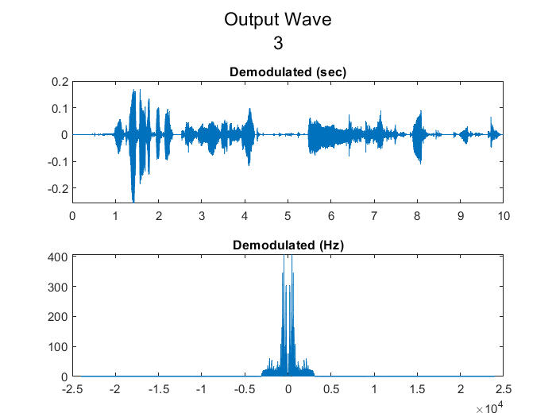

# Final All Code

## X = analyzeSignal(time_vector, x, Fs, title)

```matlab
function X =  analyzeSignal(time_vector, x, Fs, title)
    figure;
    subplot(3,1,1);
    
    plot(time_vector, x);
    xlabel('Time (sec)');
    ylabel('Amplitude');
    
    % plot frequency domain
    % n = 512 % to avoid computation that harm my device, and to make plotting more obviouse
    X = fft(x);
    X = fftshift(X); % shift value to middle at zero
    X_mag = abs(X);
    X_phase = unwrap(angle(X));
    % can make it till 20k hz because we only hear that
    freq_vector = linspace(-Fs/2, Fs/2, length(X));

    subplot(3,1,2);
    plot(freq_vector,X_mag);
    xlabel('Frequency (Hz)');
    ylabel('Amplitude');

    subplot(3,1,3);
    plot(freq_vector,X_phase);
    xlabel('Frequency (Hz)');
    ylabel('Phase (rad)');
    
    sgtitle(title);
end
```

## Main Code

```matlab
clear all;
close all;

%% ========= task 1 ======

% 1. record three audios
% == 1.2 === initalize data
FsPure = 48*1000; %sampling with 48 kHz
bitSampleRate = 16;
recorderObject = audiorecorder(FsPure, bitSampleRate, 1, 1);
recordDuration = 10;
audios = zeros(3, FsPure*recordDuration);
audios_fft = zeros(3, FsPure*recordDuration);
time = linspace(0, recordDuration, FsPure*recordDuration);
freq = linspace(-FsPure/2, FsPure/2, FsPure*recordDuration);

% == 1.2 == record if not exist or read it
if exist("input2.wav") == 2
    % read if files exist
    for i = 1:3
        filename = ['input', num2str(i), '.wav'];
        [audios(i,:), Fs] = audioread(filename);
    end
else 
    % start record
    for i = 1:3
        disp(["Start Record ", num2str(i)]);
        recordblocking(recorderObject, recordDuration);
        audios(i, :) = getaudiodata(recorderObject)';
        disp(["End Record ", num2str(i)]);
    end
    % listen to the record
    load chirp.mat
    for i = 1:3
        sound(audios(i,:), recorderObject.SampleRate)
        pause(recordDuration)
    end
    % save records
    for i = 1:3
        filename = ['input', num2str(i), '.wav'];
        audiowrite(filename,audios(i,:), FsPure);
    end
end

for i = 1:3
    audios_fft(i,:) = fftshift(fft(audios(i,:)));
end
%% ========= task 2 ======
% limit max frequency to suitable value & make sure it doesn't change much

bandwidth = 3000;
f_cutoff = 2*bandwidth;
w_cutoff = 2*pi*f_cutoff;
audios_filtered = zeros(3, FsPure*recordDuration);
audios_filtered_fft = zeros(3, FsPure*recordDuration);
for i = 1:3
    audios_filtered(i,:) = lowpass(audios(i,:), bandwidth, FsPure);
    audios_filtered_fft(i,:) = fft(audios_filtered(i,:));
    audios_filtered_fft(i,:) = fftshift(audios_filtered_fft(i,:));
    %sound( audios_filtered(i,:), recorderObject.SampleRate);
    %pause(recordDuration);
   
end

% plot signals before and after
for i = 1:3
    figure;
    
    subplot(4,1, 1);
    
    plot(time, audios(i,:));
    title("Amplitude Before");
    xlabel('Time (sec)');
    ylabel('Amplitude');

    subplot(4,1, 2);
    
    plot(time, audios_filtered(i,:));
    title("Amplitude After");
    xlabel('Time (sec)');
    ylabel('Amplitude');
    
    subplot(4,1, 3);
      
    plot(time, abs(audios_fft(i,:)));
    title("Frequency Magnitude Before");
    xlabel('Frequency (Hz)');
    ylabel('Amplitude');

    subplot(4,1, 4);
    
    plot(time, abs(audios_filtered_fft(i,:)));
    title("Frequency Magnitude After");    
    xlabel('Frequency (Hz)');
    ylabel('Amplitude');

    sgtitle(["audio ", num2str(i)])
end
%% ========= task 3 ======
% FDM SSB modulation
modulated_audios_fft = zeros(3,FsPure*recordDuration);
final_signal = zeros(1,FsPure*recordDuration);

for i = 1:3
    % initlaize
    x = audios_filtered(i,:);
    X = audios_filtered_fft(i, :);
    % initalize carrier 
    Fc = (2+1.5*i)*bandwidth ;
    Wc = 2*pi*Fc;
    c = cos(Wc .* time);
    % performing DSB modulation
    modulated_x = c .* x;
    modulated_X= fftshift(fft(modulated_x));
    % plot difference before and after modulation
    figure;
    subplot(3,1, 1);
    plot(freq, abs(X));
    title("Message (Hz)");
    subplot(3,1, 2);
    plot(freq, abs(modulated_X));
    title("Modulated Signal (Hz)");
    % perform bandwidth to take single side band
    subplot(3,1, 3);
   
    bandpass_filter3 = designfilt('bandpassfir', 'FilterOrder', 500,'CutoffFrequency1', 0.1,'CutoffFrequency2', Fc, 'SampleRate', FsPure);
    ssb_modulated_x = filter(bandpass_filter3, modulated_x);
    ssb_modulated_X = fftshift(fft(ssb_modulated_x));
    
    plot(freq, abs(ssb_modulated_X));
    title("LSB Modulated (Hz)")
    sgtitle(["SSB Modulation", num2str(i)])
    
    % added to final signal
    modulated_audios_fft(i,:) = ssb_modulated_X; % store it to print it in colorful mode

    final_signal = final_signal + ssb_modulated_x;
end

%% ========= task 4 ======
figure;
subplot(2, 1, 2);
plot(freq, abs(modulated_audios_fft))
title("FDM output (Hz)");
subplot(2, 1, 1);
plot(time, final_signal);
title("FDM output (sec)");
sgtitle("FDM Final Output ");

%% ========= task 5 ======
% SSB demodulation
demodulated_audios = zeros(3, FsPure*recordDuration);
demodulated_audios_fft = zeros(3, FsPure*recordDuration);
for i = 1:3
    % select channel
    Fc = (2+1.5*i)*bandwidth ;
    bandpass_filter = designfilt('bandpassfir', 'FilterOrder', 500,'CutoffFrequency1', Fc - bandwidth ,'CutoffFrequency2', Fc, 'SampleRate', FsPure);
    x_selected = filter(bandpass_filter, final_signal);
   
    c_selected = cos(Wc .* time);
    % restore result
    x_final = 4 .* c_selected .* x_selected;
    x_final = lowpass(x_final, bandwidth ,FsPure);
    % LPF 
    demodulated_audios(i,:) = x_final;
    demodulated_audios_fft(i,:) = fftshift(fft(x_final));
end

figure;
subplot(2, 1, 1);
plot(time, audios_filtered);
title("Message (sec)");

subplot(2, 1, 2);
plot(time, demodulated_audios);
title("Demodulated (sec)");

sgtitle("Look ON difference");

for i = 1:3
    figure;
    subplot(2, 1, 2);
    plot(freq, abs(demodulated_audios_fft(i,:)));
    title("Demodulated (Hz)");

    subplot(2, 1, 1);
    plot(time, demodulated_audios(i,:));
    title("Demodulated (sec)");
    sgtitle(["Output Wave", num2str(i)]);
    filename = ['output', num2str(i), '.wav'];
    audiowrite(filename, demodulated_audios(i,:), FsPure);
end
```